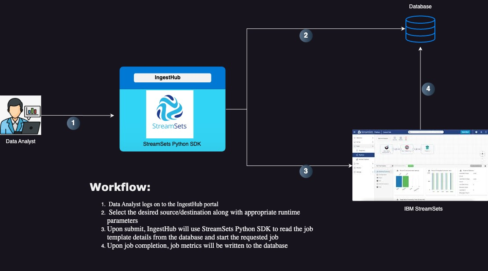

# IngestHub

## How it works?

```commandline
* The app allows users to take advantage of pre-built StreamSets Job template to ingest data to/from a variety of data sources.
* No in-depth StreamSets knowledge required
```

1. Users will be able to pick from a range of origin and destinations they want to work with.
2. Based on the origin/destination selection, a pre-defined template will be selected
3. Users will be able to change the runtime configurations for the origin/destination ** [except static parameters]
4. On submit, the app will launch a new StreamSets job using the parameters specified in #3. 
5. The completed job details can be viewed on the jobs page



## Why enable Self-Service Data Ingestion ? 
Key benefits:

1. Self-service ingestion allows enterprises to move away from a fragmented approach to data capturing, enrichment, and processing.

2. Empowers everyone in an organization to make data-driven decisions by making a broad range of data sources available for analytics purpose.

3. Empowers non-technical users to replicate data for their analytics needs.

4. Empowers users to focus on high-value analytics vs creating/maintaining ETL jobs

5. Self-Service data ingestion is inherently scalable and performant

6. Democratize new data sources faster and at-scale.

## Pre-req: 
1. [Install](https://docs.streamsets.com/platform-sdk/learn/installation.html) StreamSets SDK for Python and other packages
```commandline
pip3 install -r requirements.txt
```
2. Create the following configuration files under 'private' directory:

credentials.properties:
```
[DEFAULT]

[SECURITY]
CRED_ID=<SCH CRED_ID>
CRED_TOKEN=<SCH CRED_TOKEN>
```
3. Create some job templates
4. Prepare the sql to insert template information into the database.The app will create the required tables and insert the data. 
   Example SQL - ./sql/initial.sql


## To run the app:
1. Run 'python ingest_hub.py'
2. Hit 'http://localhost:5003' in the browser
